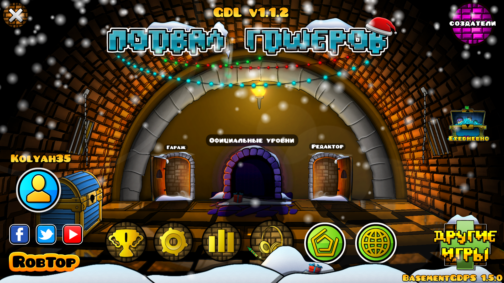
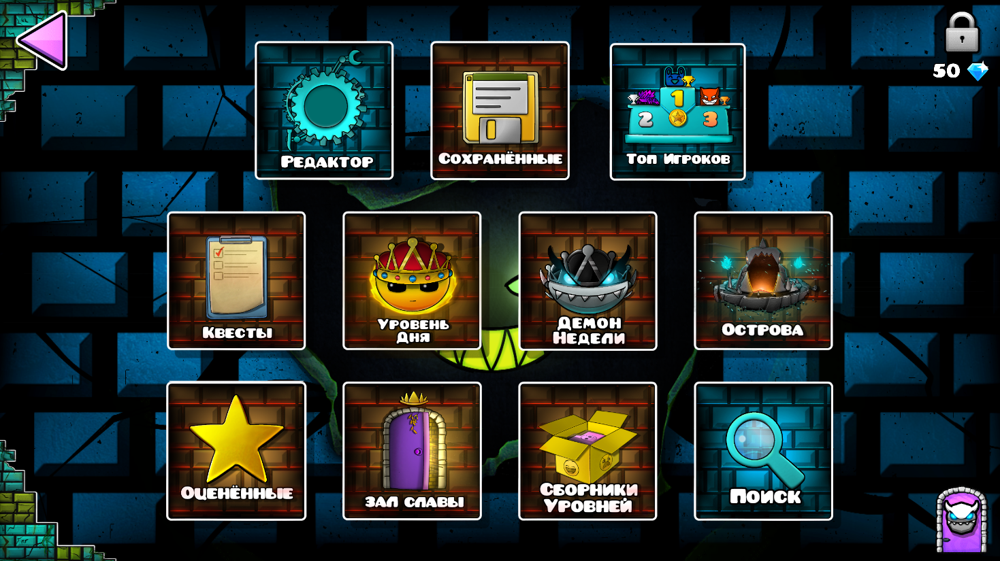
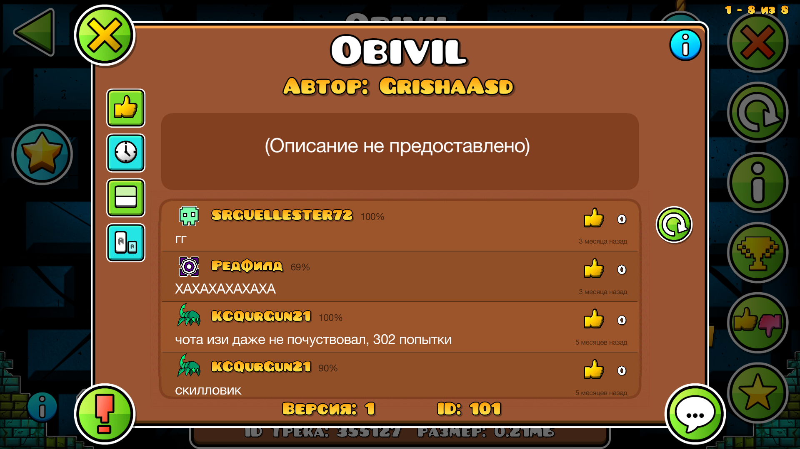
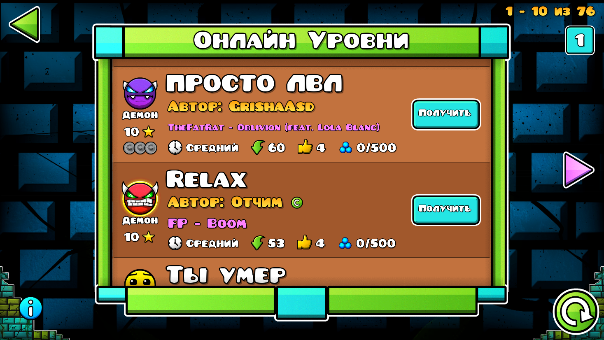
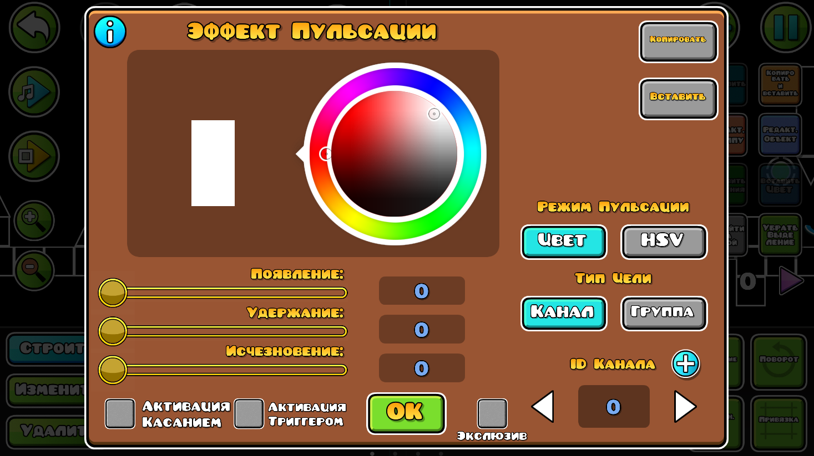

# BasementGDPS

Исходный код [Geode](https://geode-sdk.org/) мода, который делает Geometry Dash клиентом приватного сервера "Подвал ГДшеров". Разработка была прекращена в мае 2024.

## Преимущества
* Полная поддержка русского языка в игре
* Кнопка Discord в профиле
* AFK режим в главном меню

## Скриншоты
  
 

## Зависимости
Мод использует [GDL API](https://github.com/gdlocalisation/gdl-geode) для мультиязычности.

## Совместимость
На этапе активной разработки мод был совместим с Windows и Android (arm-v7/arm64).

## Авторы
* [JaanDev](https://github.com/JaanDev) - Лидирующий разработчик
* [Kolyah35](https://github.com/Kolyah35) - Руководитель, разработчик
* [danilka22ah](https://github.com/danilka22ah) - Художник, дизайнер

## Отдельная благодарность
* [InviseDivine](https://discord.com/users/683023856264544299) - Домашний сервер
* [dogotrigger](https://discord.com/users/1087733299792855060) - LevelAPI (Подвальный информатор)
* [demolena](https://discord.com/users/979263794071101440) - Модератор, маркетолог
* [KCQurGun21](https://discord.com/users/654687949228736513) - Модератор
* [CollegeBoy](https://discord.com/users/968434463619055656) - Модератор
* [sprrrite](https://discord.com/users/932356953861156924) - Модератор
* [Chillik](https://discord.com/users/771027563803443230) - Модератор
* [peeplz](https://discord.com/users/829056044772098138) - Модератор
* [nasstyles](https://discord.com/users/1033488998208909373) - Помощник
* [zobhhh](https://discord.com/users/848305386305355857) - Просто хороший человек
* [Partur](https://discord.com/users/497770123604525057) - Помощь с кодом
* [sleepyut](https://discord.com/users/463213709637058560) - Помощь с кодом
* [\> sazix](https://discord.com/users/814171134207459328) - Помощь с разработкой серверной части
* [hreno](https://discord.com/users/896293425526210580) - Реформа модерации
* [qqeeaa](https://discord.com/users/1094284995876630568) - Великолепные идеи
* [Herobrini](https://discord.com/users/999676300891533322) - Потрясающие идеи
* [Sleepingcat17](https://discord.com/users/925398072505286686) - Невероятные идеи
* [rainbow prism :0](https://discord.com/users/854320253134569502) - Поиск багов 
* [DeL](https://discord.com/users/1015611842858602506) - Поиск багов 
* [YourBunnyWrote](https://discord.com/users/346337349342330892) - Поиск багов 
* [Ничъ](https://discord.com/users/760103184814571550) - Поиск багов 
* [ribk](https://discord.com/users/353808810181394432) - Поиск багов 
* [eve](https://discord.com/users/976163496758747167) - Поиск багов 
* [3akat](https://discord.com/users/1066229270164287538) - Поиск багов 
* [Brown Monster](https://discord.com/users/678584106363256832) - Поиск багов 
* [Winuxx](https://discord.com/users/914133049313230849) - Поиск багов
* [cvantumis](https://discord.com/users/962385572775727154) - Поиск багов 
* [SpaceUK](https://discord.com/users/745675694570209380) - Поиск багов
* [e2e4](https://discord.com/users/858363705011994655) - Поиск багов 
* [matnaw](https://discord.com/users/1078962182055788615) - Поиск багов 
* [ForgotenXD](https://discord.com/users/1073261697323778099) - Поиск багов 
* [XinikieN](https://discord.com/users/763123516702720101) - Поиск багов 
* [oddpencil](https://discord.com/users/1151209763267416164) - Поиск багов 
* [Kebabovich Kebab](https://discord.com/users/1168289429643858005) - Поиск багов
* [fainypunk](https://discord.com/users/1113888684828270723) - Поиск багов
* [Bravlov](https://discord.com/users/1025056466631143444) - Поиск багов 